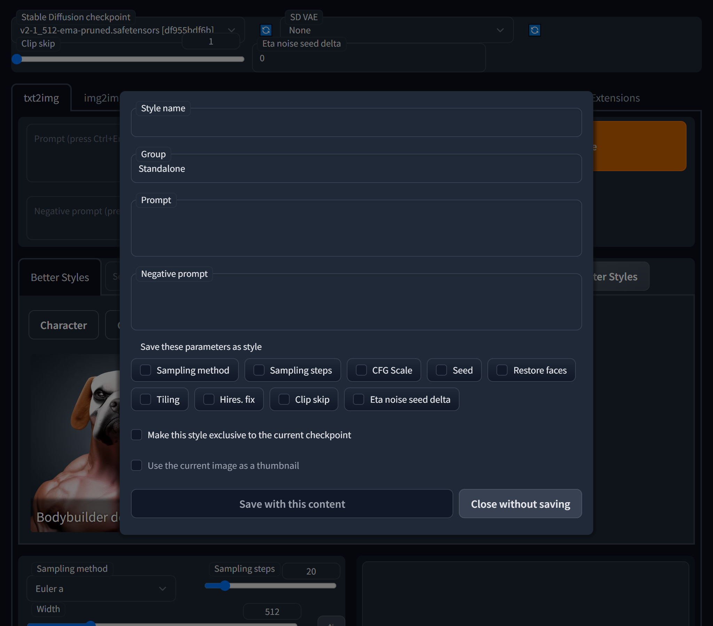

= Better Styles

Better Styles is an extension of https://github.com/AUTOMATIC1111/stable-diffusion-webui[Stable Diffusion web UI] that improves the user interface for managing styles.

English | link:docs/README-ja.adoc[日本語]

== Overview
Better Styles is a GUI for managing styles that has a UI similar to Extra networks' gallery. While the original Styles feature can only save prompts and negative prompts, Better Styles can save parameters such as "Sampling method" and "CFG Scale" as styles. Additionally, by setting a thumbnail for each style like in Extra networks' UI, you can handle styles intuitively.

image::docs/images/overview.png[Image - Better Styles UI]

== Installation
=== Installing from the Browser (Recommended)
You can install it from the Install from URL in the Extensions tab. Just enter https://github.com/eideehi/sd-webui-better-styles.git in the "URL for extension's git repository" field and press the "Install" button.

image::docs/images/install.png[Image - Install]

=== Installing using Git
You can also install it by running the following command in the directory where you installed Stable Diffusion web UI:
[source,shell]
----
git clone https://github.com/eideehi/sd-webui-better-styles.git extensions/sd-webui-better-styles
----

=== Using a different version
By following the above steps, the latest version will be installed. However, it may not work with the version of your Web UI that you are using. If Better Styles is not working properly, you may be able to solve the problem by using a different version.

To change the version of Better Styles, you need to use git. In the **directory where you installed Better Styles** in the **extensions** directory of the Stable Diffusion web UI, run the following command.
[source,shell]
----
git checkout x.y.z
----

NOTE: Replace "x.y.z" above with the version you want to use. The available versions are as follows.

|===
| Version       | Web UI Version (minimum) | Web UI Version (maximum)
| 1.0.0 - 1.0.1 | b2073781 (2023-02-16)    | a9eab236 (2023-03-24)
| 1.1.0 - 1.1.3 | 9e1afa9e (2023-03-25)    | Somewhere up to 1.1.0
| 1.2.0         | 1.1.0                    | ~
|===

Please note that the minimum and maximum Web UI versions where Better Styles works are based on the developer's testing, and the version may vary.

=== Reverting to the latest version
Now that you have switched to a different version, clicking the "Check for updates" button will not fetch updates for Better Styles, and it will always display "Latest". To update Better Styles by reverting to the latest version, use the following git command.
[source,shell]
----
git checkout main
----

With this command, you can update Better Styles using the "Check for updates" button.

NOTE: Since version 1.2.0, you can change the version from the Settings tab. For details, please refer to <<version_change>>.

== Usage
=== Displaying Better Styles content
When you install Better Styles, a new button (an emoji of a bookmark 🔖) will be added under the "Generate" button in the txt2img and img2img tabs. Clicking this button will display the content of Better Styles.

=== Saving styles
When you click the "Save style" button, a dialog box will appear for saving the style. Here's an explanation of each item:

==== Style name (required)
Enter a name for the style you want to save. Be careful not to give it a long name, as it may be abbreviated in the list. If you enter a name that is the same as an existing style, you can overwrite that style.

==== Group (required)
Enter the group to which the style belongs. The default value is the currently selected group.

==== Prompt
Enter the prompt you want to save as a style. The default value is the value currently entered in the prompt area. You can leave this field blank if you don't want to include a prompt for the style.

==== Negative prompt
Enter the negative prompt you want to save as a style. The default value is the value currently entered in the negative prompt area. You can leave this field blank if you don't want to include a negative prompt for the style.

==== Save these parameters as style
Save the parameters that have been checked as a style.

==== Make this style exclusive to the current checkpoint
Choose whether to make this style exclusive to the currently loaded model. If you make it an exclusive style, it will not be displayed in the list if another model is loaded.

==== Use the current image as a thumbnail
Choose whether to use the currently selected image as the thumbnail for this style. This item will be disabled if no image is selected.

=== Applying styles
You can apply a style by selecting it from the list of styles and clicking the "Apply style" button. You can select multiple styles, but you cannot select styles from different groups at the same time.

=== Deleting styles
You can delete a style by selecting it from the list of styles and clicking the "Delete style" button.

== Configuration
Better Styles creates its own config section in the Settings tab. Here's an explanation of each item:

image::docs/images/settings.png[Image - Settings]

=== Version of Better Styles [[version_change]]
You can change the version of Better Styles. Selecting a blank space will change it to the latest version at that point. If you change the settings, it is necessary to restart the Web UI. (not just reload)

TIP: The current version of Better Styles is displayed in the console of the Web UI.

=== Display update notifications
If checked, it will display notifications when updates are available.

=== Notify of updates only once per version
If checked, it will only notify once for each version when updates are available.

=== Interval at which to display update notifications
Specify the interval for displaying update notifications. The unit is "days", and the default value is 1 day.

=== Hide the original Styles
Choose whether to hide the original Styles dropdown and associated button.

=== Language of Better Styles
Specify the language to use for the Better Styles component. The default value is blank (English). Currently, ja_JP language is available.

== License
Better Styles is developed and released under the MIT license. For details on the license, please refer to the following link:

link:LICENSE[MIT License]