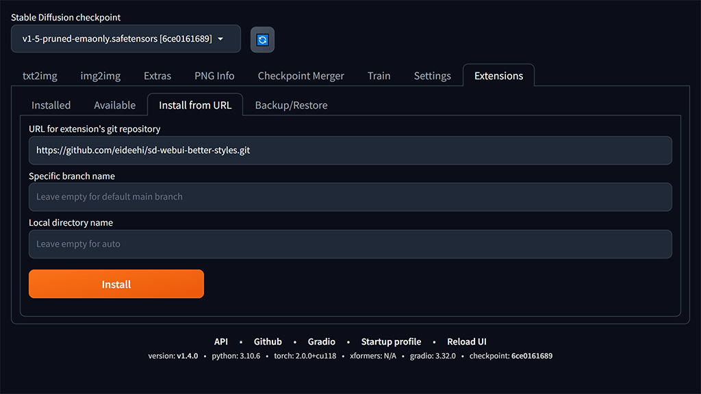
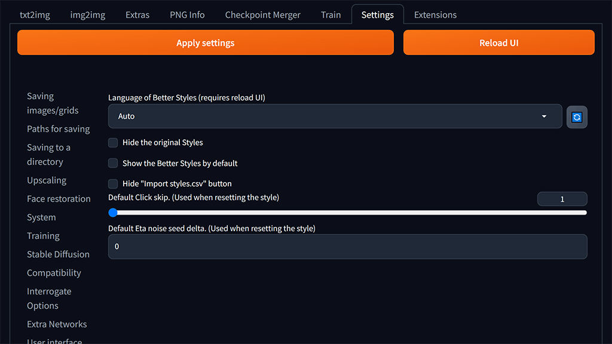

= Better Styles

English | link:docs/README-ja.adoc[日本語]

Better Styles is an extension of https://github.com/AUTOMATIC1111/stable-diffusion-webui[Stable Diffusion web UI] that provides a user-friendly UI for managing styles.

== Overview
Better Styles offers an improved GUI for managing styles. Unlike the original Styles feature, which only saves prompts and negative prompts, Better Styles allows you to save parameters such as sampling methods and CFG scales as styles. Additionally, it supports setting thumbnails for styles, making it intuitive to handle styles.

image::docs/images/overview.png[Image - Better Styles UI]

== Notes
Better Styles is a JavaScript-based extension. If JavaScript files are not loaded correctly, such as when using the `--data-dir` option, Better Styles may not function properly.

== Installation
=== Install from the Browser (Recommended)
You can install it from the Extensions tab by clicking `Install from URL` and entering https://github.com/eideehi/sd-webui-better-styles.git in the `URL for extension's git repository` field, then clicking the `Install` button.

=== Install Using Git
You can also install it by running the following command in the directory where Stable Diffusion web UI is installed.
[source,shell]
----
git clone https://github.com/eideehi/sd-webui-better-styles.git extensions/sd-webui-better-styles
----

=== Using a Different Version
When you install using the methods above, the latest version will be installed. However, it might not work with the version of Web UI you are using. If Better Styles does not work correctly, you can try using a different version.

To change the version of Better Styles, use git in the **Better Styles installed directory** inside the **extensions** directory of Stable Diffusion web UI. Execute the following command:
[source,shell]
----
git checkout x.y.z
----

NOTE: Replace "x.y.z" with the version you want to use. The available versions are as follows:

|===
| Version   | Web UI Version (Minimum) | Web UI Version (Maximum)
| 1.0.0 - 1.0.1 | b2073781 (2023-02-16)     | a9eab236 (2023-03-24)
| 1.1.0 - 1.1.3 | 9e1afa9e (2023-03-25)     | Somewhere up to 1.1.0
| 1.2.0         | 1.1.0                     | 1.4.0
| 1.3.0         | 1.1.1                     | 1.4.0
| 1.4.0 - 1.4.1 | 1.1.1                     | ~
|===

The minimum and maximum versions of Web UI in which Better Styles work are based on the developer's testing, and versions might change slightly.

=== Reverting to the Latest Version
If you switched to a different version, the "Check for updates" button will not fetch updates for Better Styles, and it will always show "Latest." To revert to the latest version and enable updates, use the following git command:
[source,shell]
----
git checkout main
----

Now you can update Better Styles using the "Check for updates" button.

== Usage
=== Displaying Better Styles Contents
After installing Better Styles, a new button (bookmark emoji 🔖) will be added below the "Generate" buttons in the `txt2img` and `img2img` tabs. Click this button to display Better Styles contents. If you want Better Styles to be displayed by default when the Web UI starts, you can use the <<show_by_default>> option to make the change.

=== Saving Styles
Click the `Add style` button to display a form for saving styles. It is similar to the Web UI's form, but you can exclude fields by setting them as blank. Additionally, you can use the <<exclude_default_values>> checkbox to ignore fields with default values when saving the style.

==== Unique Items in Better Styles
In the following, we will explain the unique items in Better Styles that appear in the form.

===== Group (Required)
Enter the group to which the style belongs. The default value is the currently selected group. If the "all" group is selected, the `default` group will be set as the initial value.

===== Style name (Required)
Enter the name of the style to be saved. Be cautious about using long names as they may be truncated in the list.

===== Checkpoint exclusive
You can set the style to be exclusive to a selected checkpoint using a dropdown. Styles marked as exclusive will not appear in the list if a different checkpoint is loaded. However, they will still be displayed in the `all` group.

===== Fields with default values will be excluded [[exclude_default_values]]
If this option is checked, fields with default values will not be saved as part of the style, even if they have values entered.

===== Thumbnail
If images are generated and the gallery is enabled, you can select a thumbnail.

=== Applying Styles
From the list of styles, select the style you want to apply, and click the `Apply styles` button to apply the style.

=== Deleting Styles
From the list of styles, select the style you want to delete, and click the `Delete styles` button to delete the style.

=== Resetting Styles
Click the `Reset style` button to reset the current style to its default values.

=== Importing styles.csv
Click the `Import styles.csv` button to import the contents of styles.csv into the `styles.csv` group. If the `styles.csv` group does not exist, it will be created. Additionally, you can hide this button using the <<hide_import_styles_csv>> option.

== Configuration
Better Styles creates its own configuration section in the Settings tab. Below are explanations for each item.

=== Language of Better Styles
Specify the language for using the Better Styles component. The default value is `Auto`, which means it uses the language set in the Web UI. Currently, the language `ja_JP` is available.

=== Hide the original Styles
Choose whether to hide the original Styles dropdown and related buttons.

=== Show the Better Styles by default [[show_by_default]]
Select whether to show the Better Styles component by default when starting the Web UI.

=== Hide "Import styles.csv" button [[hide_import_styles_csv]]
Choose whether to hide the `Import styles.csv` button.

=== Default Click skip
Set the initial value for `Click skip` when resetting styles using the `Reset style` button.

=== Default Eta noise seed delta
Set the initial value for `Eta noise seed delta` when resetting styles using the `Reset style` button.

== License
Better Styles is developed and released under the MIT license. For details about the license, refer to the following link:

link:./LICENSE[MIT License]
