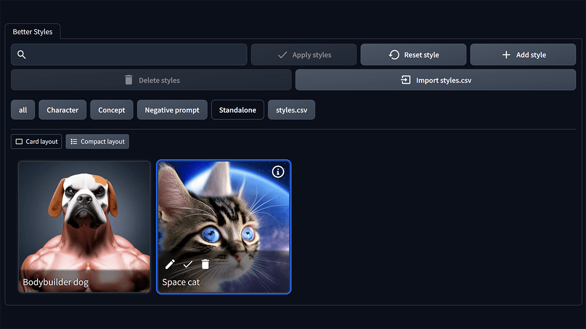

= Better Styles

Better Styles is an extension of https://github.com/AUTOMATIC1111/stable-diffusion-webui[Stable Diffusion web UI] that improves the user interface for managing styles.

English | link:docs/README-ja.adoc[日本語]

== Overview
Better Styles is a GUI for managing styles that has a UI similar to Extra networks' gallery. While the original Styles feature can only save prompts and negative prompts, Better Styles can save parameters such as "Sampling method" and "CFG Scale" as styles. Additionally, by setting a thumbnail for each style like in Extra networks' UI, you can handle styles intuitively.

== Usage
=== Displaying Better Styles content
When you install Better Styles, a new button (an emoji of a label 🏷) will be added under the "Generate" button in the txt2img and img2img tabs. Clicking this button will display the content of Better Styles.

=== Saving styles
When you click the "Save style" button, a dialog box will appear for saving the style. Here's an explanation of each item:
image:docs/images/save-dialog.png[Image - Save dialog]

Style name (required)::
Enter a name for the style you want to save. Be careful not to give it a long name, as it may be abbreviated in the list. If you enter a name that is the same as an existing style, you can overwrite that style.

Group (required)::
Enter the group to which the style belongs. The default value is the currently selected group.

Prompt::
Enter the prompt you want to save as a style. The default value is the value currently entered in the prompt area. You can leave this field blank if you don't want to include a prompt for the style.

Negative prompt::
Enter the negative prompt you want to save as a style. The default value is the value currently entered in the negative prompt area. You can leave this field blank if you don't want to include a negative prompt for the style.

Make this style exclusive to the current checkpoint::
Choose whether to make this style exclusive to the currently loaded model. If you make it an exclusive style, it will not be displayed in the list if another model is loaded.

Use the current image as a thumbnail::
Choose whether to use the currently selected image as the thumbnail for this style. This item will be disabled if no image is selected.

Include the 'Sampling method' as a style::
Choose whether to save the sampling method as a style.

Include the 'CFG Scale' as a style::
Choose whether to save the CFG scale as a style.

=== Applying styles
You can apply a style by selecting it from the list of styles and clicking the "Apply style" button. You can select multiple styles, but you cannot select styles from different groups at the same time.

=== Deleting styles
You can delete a style by selecting it from the list of styles and clicking the "Delete style" button.

=== Config
Better Styles creates its own config section in the Settings tab. Here's an explanation of each item:
image:docs/images/settings.png[Image - Settings]

Hide the original Styles::
Choose whether to hide the original Styles dropdown and associated button.

Language of Better Styles::
Specify the language to use for the Better Styles component. The default value is blank (English). Currently, ja_JP language is available.

== License
Better Styles is developed and released under the MIT license. For details on the license, please refer to the following link:

link:LICENSE[MIT License]